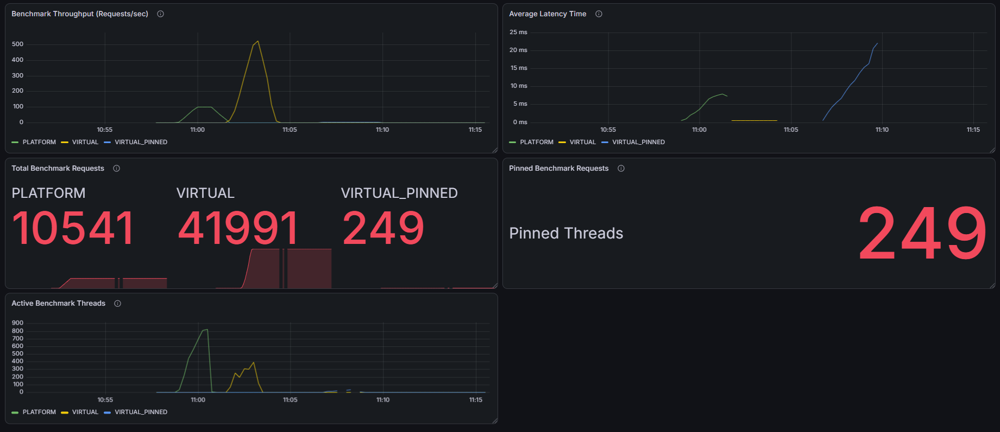

# Java Virtual Threads Performance Analyzer

A Spring Boot benchmarking project that evaluates and compares the runtime performance of:

1. **Platform Threads** — classic Java threads
2. **Virtual Threads** — Project Loom, Java 21+
3. **Virtual Threads with Pinning** — `synchronized` + shared lock contention

The application exposes REST endpoints, simulates I/O-bound workload under high concurrency using **k6**, and visualizes runtime metrics through **Micrometer → Prometheus → Grafana**.

---

## Why This Project Exists

Spring Boot's default request-per-thread model caps scalability at the size of Tomcat's platform thread pool (~200 threads). For I/O-bound workloads, those threads sit idle while waiting on network or database calls — wasting memory while throttling throughput.

Java 21 introduced **virtual threads** to break this barrier. This project answers two questions:

1. **Does it work?** — measure the real throughput and latency improvement.
2. **What's the catch?** — surface common footguns (pinning, lock contention) that silently negate the benefit.

---

## Architecture

```text
+-------------------+
|        k6         |
|  Load Generator   |
+---------+---------+
          |
          v
+-------------------+
|  Spring Boot API  |
| Benchmark Service |
+---------+---------+
          |
   +------+------+
   |             |
   v             v
+----------+   +-----------------+
| Platform |   |     Virtual     |
| Executor |   |    Executor     |
|  (200)   |   |  (Project Loom) |
+----------+   +-----------------+
          |
          v
+-------------------+
| Micrometer Metrics|
+---------+---------+
          |
          v
+-------------------+
|    Prometheus     |
+---------+---------+
          |
          v
+-------------------+
|      Grafana      |
+-------------------+
```

---

## Features

- Compares Platform Threads and Virtual Threads under identical workload.
- Simulates I/O-intensive blocking operations with a configurable delay.
- Demonstrates Virtual Thread pinning via `synchronized` + shared lock contention.
- Generates high-concurrency traffic with k6.
- Exports application metrics via Micrometer.
- Real-time metrics scraping via Prometheus.
- Visualizes throughput, latency, and thread activity in Grafana.
- Production-style layered Spring Boot architecture.

---

## Tech Stack

**Backend**
- Java **21** (Project Loom required)
- Spring Boot 3.x
- Virtual Threads (`spring.threads.virtual.enabled=true`)
- Micrometer
- Spring Actuator
- Lombok

**Load Testing**
- k6

**Monitoring**
- Prometheus
- Grafana

**Build Tool**
- Maven

---

## JDK Version Requirement

This project must run on **JDK 21–23**.

- JDK 24+ (via **JEP 491**) removed `synchronized` pinning. On those JVMs, the pinning scenario will behave like the regular virtual scenario, and the pinning narrative will no longer hold.
- Confirm the running JVM by visiting `/actuator/prometheus` and inspecting the `jvm_info` metric — the `version` label must start with `21.x`.

Recommended JDK: **Eclipse Temurin 21 (LTS)**.

---

## Project Structure

```text
src/main/java
│
├── controller
│   └── BenchmarkController
│
├── service
│   ├── BenchmarkService
│   ├── BenchmarkServiceImpl
│   ├── PlatformBenchmarkService
│   └── VirtualBenchmarkService
│
├── metrics
│   ├── BenchmarkMetricsService
│   └── BenchmarkThreadMetrics
│
├── config
│   ├── ExecutorConfig
│   └── BenchmarkProperties
│
├── dto
│   ├── BenchmarkResponse
│   └── ErrorResponse
│
├── exceptions
│   ├── BenchmarkException
│   └── GlobalExceptionHandler
│
└── model
    └── BenchmarkMode
```

---

## Configuration

`src/main/resources/application.properties`:

```properties
# Enable virtual threads for Tomcat request handling
spring.threads.virtual.enabled=true

# Custom platform executor size and workload tuning
benchmark.platform-thread-pool-size=200
benchmark.simulated-io-delay-ms=500

# Expose Prometheus and Tomcat metrics
management.endpoints.web.exposure.include=prometheus,health,metrics
management.metrics.enable.tomcat=true
server.tomcat.mbeanregistry.enabled=true
```

`spring.threads.virtual.enabled=true` makes Tomcat itself use virtual threads for incoming HTTP requests. This is essential — without it, every endpoint is bottlenecked at Tomcat's platform-thread pool, and the platform vs virtual comparison collapses.

---

## Benchmark Endpoints

| Endpoint | Mode | Behavior |
|---|---|---|
| `GET /api/benchmark/platform/io` | `PLATFORM` | Submits to a fixed-size platform thread pool, then blocks for the configured I/O delay. |
| `GET /api/benchmark/virtual/io` | `VIRTUAL` | Submits to a per-task virtual thread executor, then blocks for the configured I/O delay. |
| `GET /api/benchmark/virtual/pinning` | `VIRTUAL_PINNED` | Same as virtual, but wraps the I/O delay in a `synchronized` block on a shared lock to force pinning + contention. |

All three endpoints submit exactly **one** task per HTTP request so the comparison is apples-to-apples. The only difference between Virtual and Pinned is the `synchronized` block.

---

## Running the Application

Clone the repository:

```bash
git clone <repository-url>
cd threadAnalyzer
```

Verify JDK version:

```bash
java -version
# Expected: openjdk version "21.x.x"
```

Run the application:

```bash
mvn spring-boot:run
```

Application starts on:

```
http://localhost:8080
```

Verify the running JVM is JDK 21 by visiting `http://localhost:8080/actuator/prometheus` and confirming the `jvm_info` line shows `version="21.x.x"`.

---

## Metrics Endpoint

Application metrics are exposed in Prometheus format at:

```
http://localhost:8080/actuator/prometheus
```

Custom metrics exposed by this project:

| Metric | Type | Description |
|---|---|---|
| `benchmark_requests_total{mode}` | counter | Total successful benchmark requests per mode. |
| `benchmark_errors_total{mode}` | counter | Total benchmark errors per mode. |
| `benchmark_execution_time_seconds{mode}` | summary | Per-request execution duration per mode. |
| `benchmark_inflight_tasks{mode}` | gauge | Currently in-flight benchmark tasks per mode. |
| `benchmark_pinned_threads_total` | counter | Total pinned benchmark calls. |

Plus standard Spring Boot / JVM metrics including `jvm_threads_live_threads`, `tomcat_threads_busy_threads`, `process_cpu_usage`, and `http_server_requests_seconds`.

---

## Load Testing with k6

Sample k6 ramp profile:

```javascript
export const options = {
    stages: [
        { duration: '20s', target: 200  },
        { duration: '40s', target: 1000 },
        { duration: '20s', target: 0    }
    ]
};
```

Run the scripts:

```bash
k6 run platform_test.js
k6 run virtual_test.js
k6 run pinned_test.js
```

Each script hits its respective endpoint with the same ramp profile so results are directly comparable.

---

## Prometheus Configuration

`prometheus.yml`:

```yaml
global:
  scrape_interval: 5s

scrape_configs:
  - job_name: 'virtual-thread-analyzer'
    metrics_path: '/actuator/prometheus'
    static_configs:
      - targets: ['localhost:8080']
```

Run Prometheus:

```bash
prometheus.exe --config.file=prometheus.yml
```

Open Prometheus at `http://localhost:9090` to verify scraping is healthy before opening Grafana.

---

## Grafana Dashboard

The Grafana dashboard visualizes the following panels:

| Panel | Source Metric / Query | Purpose |
|---|---|---|
| **Benchmark Throughput** | `rate(benchmark_requests_total[1m])` | Requests per second per mode. |
| **Average Execution Time** | `rate(benchmark_execution_time_seconds_sum[1m]) / rate(benchmark_execution_time_seconds_count[1m])` | Average latency per mode. |
| **Total Benchmark Requests** | `benchmark_requests_total` | Cumulative request count per mode. |
| **Pinned Benchmark Requests** | `benchmark_pinned_threads_total` | Cumulative pinning scenario count. |
| **Active Benchmark Threads** | `benchmark_inflight_tasks` | Currently executing benchmark tasks per mode. |


---

## Results



## Key Findings

- Virtual threads remove the request-thread bottleneck for I/O-bound workloads.
- The platform thread pool becomes the limiting factor under high concurrency.
- A single `synchronized` block on a shared lock can completely negate the virtual thread benefit through pinning + contention.
- Enabling `spring.threads.virtual.enabled=true` is **necessary but not sufficient** — application code must also be audited for pinning patterns.

---

## Recommendation for Production Adoption

1. **Audit** existing services for `synchronized` blocks, `ThreadLocal` usage, and native (JNI) calls.
2. **Refactor** hot-path `synchronized` blocks to `ReentrantLock`.
3. **Resize** downstream resources (connection pools, rate-limited APIs) that become the new bottleneck under higher concurrency.
4. **Roll out** virtual threads on one low-risk service first and observe in production for at least one week before broader adoption.
5. **Monitor** pinning events using JFR's `jdk.VirtualThreadPinned` event in addition to standard JVM metrics.

---

## Future Enhancements

- CPU-bound benchmark scenarios.
- Dynamic workload configuration via request body.
- Built-in frontend dashboard (no external Grafana needed).
- Automated load → report → publish pipeline.
- Distributed load generation across multiple k6 workers.
- Alerting and anomaly detection on pinning events.

---

## Implementation Notes

This project was reviewed and refactored to ensure a defensible apples-to-apples comparison across the three scenarios. Key engineering decisions:

- **`@Qualifier` injection via manual constructor** in `PlatformBenchmarkService` rather than relying on Lombok's `@RequiredArgsConstructor`, because Lombok does not propagate field-level annotations to constructor parameters.
- **The pinning benchmark submits exactly one task** per HTTP request (not a batch of 100), so it has the same structural shape as the other two scenarios. The only difference is the `synchronized (lock)` block. This isolates pinning + contention as the cause of the slowdown.
- **`spring.threads.virtual.enabled=true`** is required to break Tomcat's request-thread bottleneck. Without it, all three endpoints are equally capped at Tomcat's pool size.
- **Configurable I/O delay** via `benchmark.simulated-io-delay-ms` allows the workload to be tuned to expose different bottlenecks.
- **Log statements removed** from the request hot path to avoid log flooding and benchmark skew under k6 load.
- **Metric renamed** from `benchmark.active.threads` to `benchmark.inflight.tasks` to accurately reflect what is being measured (in-flight tasks, not OS threads).
- **Generic exception fallback** added in `GlobalExceptionHandler` so unexpected errors return a structured `ErrorResponse` instead of leaking stack traces.
- **Defaults baked into `BenchmarkProperties`** (`platformThreadPoolSize = 200`, `simulatedIoDelayMs = 500`) prevent startup crashes if `application.properties` is incomplete.
- **Unused code removed**: `BenchmarkRequest` DTO, unused enum values (`CPU_BOUND`, `MIXED`), unused `virtualExecutor` bean, and unused imports.

---

## License

Specify your license here (e.g., MIT, Apache 2.0).